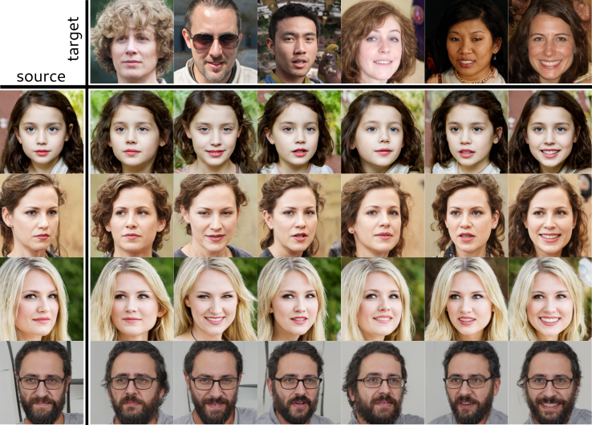

# StyleMask: Disentangling the Style Space of StyleGAN2 for Neural Face Reenactment

Authors official PyTorch implementation of **StyleMask: Disentangling the Style Space of StyleGAN2 for Neural Face Reenactment**. This paper has been accepted for publication at IEEE Conference on Automatic Face and Gesture Recognition, 2023.

>**StyleMask: Disentangling the Style Space of StyleGAN2 for Neural Face Reenactment** 
> Stella Bounareli, Christos Tzelepis, Vasileios Argyriou, Ioannis Patras, Georgios Tzimiropoulos 
>
> **Abstract**: In this paper we address the problem of neural face reenactment, where, given a pair of a source and a target facial image, we need to transfer the target's pose (defined as the head pose and its facial expressions) to the source image, by preserving at the same time the source's identity characteristics (e.g., facial shape, hair style, etc), even in the challenging case where the source and the target faces belong to different identities. In doing so, we address some of the limitations of the state-of-the-art works, namely, a) that they depend on paired training data (i.e., source and target faces have the same identity), b) that they rely on labeled data during inference, and c) that they do not preserve identity in large head pose changes. More specifically, we propose a framework that, using unpaired randomly generated facial images, learns to disentangle the identity characteristics of the face from its pose by incorporating the recently introduced style space $\mathcal{S}$ of StyleGAN2, a latent representation space that exhibits remarkable disentanglement properties. By capitalizing on this, we learn to successfully mix a pair of source and target style codes using supervision from a 3D model. The resulting latent code, that is subsequently used for reenactment, consists of latent units corresponding to the facial pose of the target only and of units corresponding to the identity of the source only, leading to notable improvement in the reenactment performance compared to recent state-of-the-art methods. In comparison to state of the art, we quantitatively and qualitatively show that the proposed method produces higher quality results even on extreme pose variations. Finally, we report results on real images by first embedding them on the latent space of the pretrained generator. 

*Pretrained models and code is coming soon.*

## Face Reenactment Results
 

